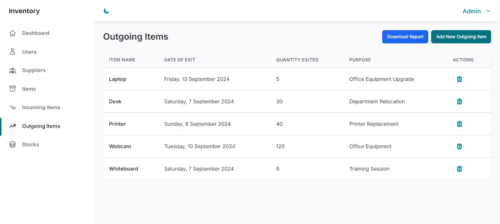
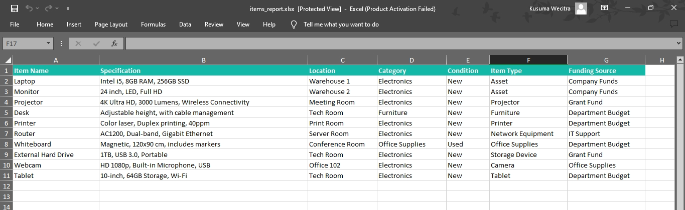

# Laravel Inventory App

Laravel Inventory App is designed to manage and track inventory items within an organization. It provides functionalities for item management, supplier management, and handling incoming and outgoing items. The app includes features for generating reports and tracking stock levels.

## Technology Stack
- **PHP**: Programming language for server-side logic.
- **Laravel**: PHP framework for web application development.
- **TailwindCSS**: CSS library for creating modern, responsive designs with utility classes.
- **Windmill Template**: Dashboard template used for the app's UI.
- **Visual Studio Code**: Text editor used for development.
- **SQLite**: Database used for local development and testing.
- **PhpSpreadsheet**: A library used for handling and generating spreadsheet files.

## Database Schema

### Items

| Column Name      | Data Type | Constraints              | Description                       |
|------------------|-----------|--------------------------|-----------------------------------|
| `id`             | `integer`  | Primary Key, Auto Increment | Unique identifier for each item  |
| `item_code`      | `string`   | Unique, Not Null         | Unique code for each item         |
| `item_name`      | `string`   | Not Null                 | Name of the item                  |
| `specification`  | `string`   |                          | Details about the item            |
| `item_location`  | `string`   |                          | Location where item is stored     |
| `category`       | `string`   |                          | Category of the item              |
| `condition`      | `string`   |                          | Condition of the item             |
| `item_type`      | `string`   |                          | Type of the item                  |
| `funding_source` | `string`   |                          | Source of funding for the item    |

### Suppliers

| Column Name      | Data Type | Constraints              | Description                      |
|------------------|-----------|--------------------------|----------------------------------|
| `id`             | `integer`  | Primary Key, Auto Increment | Unique identifier for each supplier |
| `supplier_code`  | `string`   | Unique, Not Null         | Unique code for each supplier    |
| `supplier_name`  | `string`   | Not Null                 | Name of the supplier             |
| `supplier_phone`          | `string`   |                          | Phone number of the supplier     |
| `supplier_address`        | `string`   |                          | Address of the supplier          |

### Incoming Items

| Column Name          | Data Type | Constraints              | Description                                   |
|----------------------|-----------|--------------------------|-----------------------------------------------|
| `id`                 | `integer` | Primary Key, Auto Increment | Unique identifier for each incoming item    |
| `item_code`          | `string`  | Foreign Key              | Code of the item being added                |
| `date_of_entry`      | `date`    | Not Null                 | Date when the item was entered              |
| `quantity_entered`   | `integer` | Not Null                 | Quantity of items entered                   |
| `supplier_code`      | `string`  | Foreign Key              | Code of the supplier providing the items    |

### Outgoing Items

| Column Name         | Data Type | Constraints              | Description                                  |
|---------------------|-----------|--------------------------|----------------------------------------------|
| `id`                | `integer` | Primary Key, Auto Increment | Unique identifier for each outgoing item |
| `item_code`         | `string`  | Foreign Key              | Code of the item being removed              |
| `date_of_exit`      | `date`    | Not Null                 | Date when the item was removed              |
| `quantity_exited`   | `integer` | Not Null                 | Quantity of items removed                   |
| `purpose`           | `string`  |                          | Purpose for which items are removed         |

### Stocks

| Column Name                | Data Type | Constraints              | Description                                  |
|----------------------------|-----------|--------------------------|----------------------------------------------|
| `item_code`                | `string`   | Foreign Key, Primary Key, Not Null    | Unique identifier for each record                            |
| `quantity_of_incoming_items` | `integer` |                          | Total quantity of incoming items            |
| `quantity_of_outgoing_items` | `integer` |                          | Total quantity of outgoing items            |
| `total_items`              | `integer`  |                          | Total quantity of items in stock            |

## Screenshots

### Login

### Dashboard

 

### Users

### Suppliers

### Items

### Incoming Items

### Outgoing Items

### Stocks

### Form + Validation

### Report.xlsx
